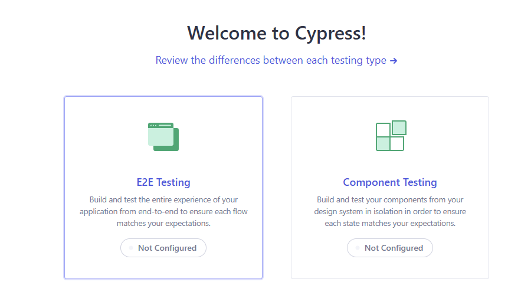
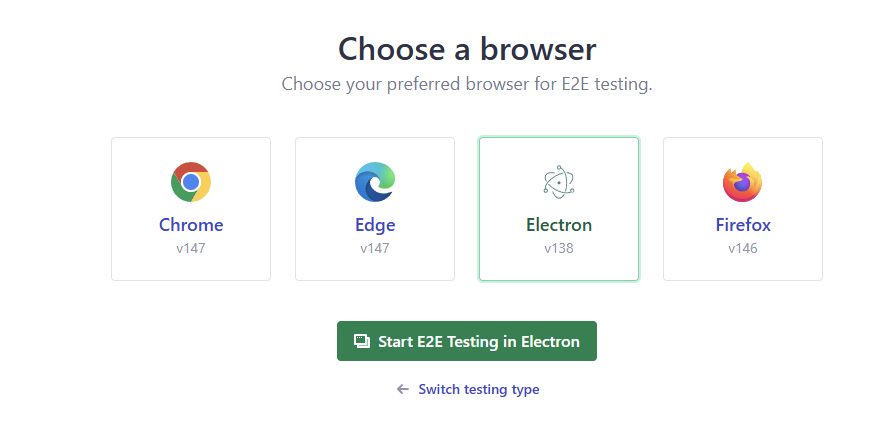
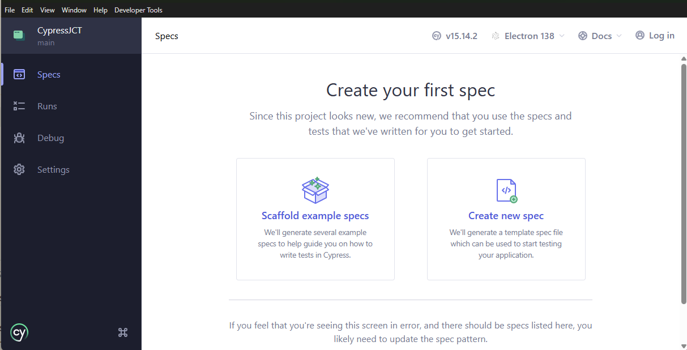

# Commands to Setup From Scratch

## Creation of Node project in local system.
1. Command to be use to create a node project: `npm init -y`.

## Installation of Cypress in project
1. Command to install cypress in system `npm install cypress --save-dev`.
2. It installs cypress and details of dependencies are added inside `package.json` under `devdependencies`.

## Open cypress to create a new project [not selecting existing templates]:
1. command: `npx cypress open`.
2. In the dialog box for QA related, we must select E2E Testing.

3. Select any of your favourite browser. Cypress Default Browser: **Electron**.

4. Creation of First Spec, Select **Create New Spec**.

5. Close the cypress windows, check **cypress_config.js** file is created under `cypress` folder.

## Installation Commands for **Cucucmber** in cypress projects.
1. command: `npm i -D cypress-cucumber-preprocessor`
2. command2: `npm install --save-dev cypress-cypress-cucumber-preprocessor`

